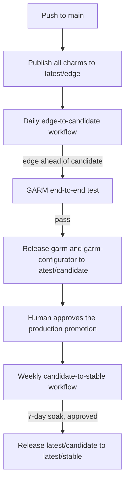

---
myst:
  html_meta:
    "description lang=en": "Explain how GitHub runner charms move through edge, candidate, and stable risk levels."
---

(release_process)=

# Charm release and promotion process

GitHub runner charm releases move through three Charmhub channels:
`latest/edge`, `latest/candidate`, and `latest/stable`.

Publication to `latest/edge` and promotion to `latest/candidate` are automated.
Two decisions require human review:

- whether to take a candidate revision into production, and
- whether a candidate revision has truly soaked in production long enough to
  become stable.

## Channel flow

Every push to `main` publishes all charms to `latest/edge` through
`.github/workflows/publish_charms.yml`.

Once a day, `promote_edge_to_candidate.yaml` compares the edge revision with
the candidate revision. If edge is not ahead of candidate, the workflow skips
so the repository does not run the expensive end-to-end test.
When edge is ahead, the workflow runs the GARM end-to-end test from
`garm_e2e.yaml` against the published edge revision. If that test passes, the
workflow releases the new revision to `latest/candidate`.

Only two charms move through this automated edge-to-candidate promotion:
`garm` and `garm-configurator`. They always move together because the
end-to-end test covers the two charms simultaneously: one revision of
`garm` is validated against only one other revision of `garm-configurator`.
The promotion does not require a new edge revision for both charms
— the check step compares each charm's edge
and candidate revisions independently, and promotes whichever charm is ahead.
If only `garm` gets a new revision, `garm-configurator` is retested and
re-released at its current, unchanged edge revision alongside it, so
a successful promotion leaves `latest/candidate` holding a pair that was
validated together.

Charmhub has no way to release two charms in one transaction, so the workflow
releases `garm` first and `garm-configurator` after.
If the `garm-configurator` release fails, then
`latest/candidate` holds a mismatched pair. The workflow says so
in its run summary, naming what it already released.

## Human review gates

Production does not follow candidate automatically. Instead, production is
pinned to a specific candidate revision, and moving that pin to a newer
candidate revision requires a human to review and approve the change. That
approval is the production gate.

Once a candidate revision has soaked for seven days, the weekly
`promote_candidate_to_stable.yaml` workflow promotes it to `latest/stable`.
The workflow uses a GitHub Environment named `charmhub-stable` with required
reviewers so a human approves the stable release at the end of the soak window.

### Production promotion gate

This gate decides whether a candidate revision should move into production.
The reviewer checks that the revision is the one they want to run in the live
environment before approving the change that moves the production pin.

### `charmhub-stable` environment gate

This gate decides whether a candidate revision is ready to become stable.
The weekly workflow measures soak time using the Charmhub candidate release
timestamp. That timestamp proves when the revision was published to
`latest/candidate`; it does **not** prove that production ran that revision for
the full soak window. The reviewer at this gate must confirm that the revision
really has been running in production for the required time.

## The `charmhub-stable` environment

The stable gate needs one piece of repository configuration: a GitHub
Environment named `charmhub-stable` with required reviewers. It already exists.
The environment carries no secrets of its own — the weekly workflow
authenticates to Charmhub with the repository-level `CHARMHUB_TOKEN` secret, the
same one the other release workflows use. The environment is there for the
approval, not for the credentials.

A missing environment would not cause the workflow to fail — GitHub treats
`environment:` pointing at nothing as a no-op and runs the job straight through.
The weekly workflow therefore queries the environment using
its `verify-environment` job and fails the run if it is absent.

## Hotfixes and rollbacks

Maintainers can release hotfixes to candidate or restore earlier revisions
manually. Both paths still require approval before production changes.
