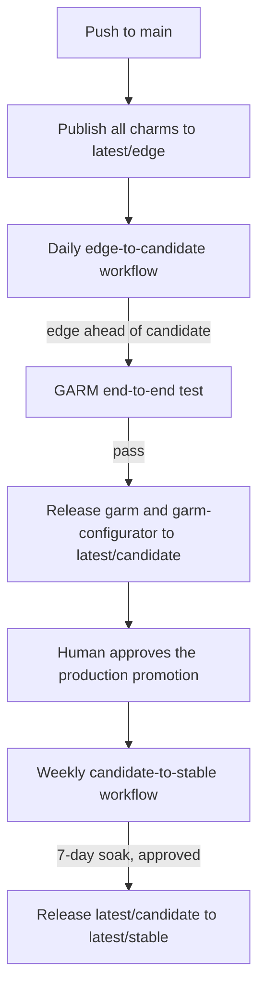

---
myst:
  html_meta:
    "description lang=en": "Explain how GitHub runner charms move through edge, candidate, and stable."
---

(release_process)=

# Charm release and promotion process

GitHub runner charm releases move through three Charmhub channels:
`latest/edge`, `latest/candidate`, and `latest/stable`.

The release process is designed to keep the fast path automated while leaving
the two production decisions with a human reviewer:

- whether to take a candidate revision into production, and
- whether a candidate revision has truly soaked in production long enough to
  become stable.



## Channel flow

Every push to `main` publishes all charms to `latest/edge` through
`.github/workflows/publish_charms.yml`.

Once a day, `promote_edge_to_candidate.yaml` compares the edge revision with
the candidate revision. If edge is not ahead of candidate, the workflow skips
so the repository does not rerun the expensive end-to-end test for no change.
When edge is ahead, the workflow runs the GARM end-to-end test from
`garm_e2e.yaml` against the published edge revision. If that test passes, the
workflow releases the new revision to `latest/candidate`.

Only two charms move through this automated edge-to-candidate promotion:
`garm` and `garm-configurator`. They always move together, because the
configurator supplies GARM's scale-set configuration: a revision of one is only
ever validated against the revision of the other it was tested with, and the
end-to-end test exercises the pair. "Together" does not mean both must have a
new edge revision on the same day — the check step compares each charm's edge
and candidate revisions independently, and promotes whichever charm is ahead.
If only `garm` gets a new revision, `garm-configurator` is retested and
re-released at its current, unchanged edge revision alongside it, so
`latest/candidate` always holds a pair that was actually validated together,
never a `garm` bump promoted on its own.

Charmhub has no way to release two charms in one transaction, so the workflow
releases them one after the other — `garm`, with the `app-image` resource
revision that was attached to the tested edge revision, then
`garm-configurator`. If the second release fails, the first has already
happened: `latest/candidate` then holds a mismatched pair. The workflow says so
in its run summary, naming what it already released.

The check step compares live Charmhub revisions rather than tracking what a
run already did, so simply re-running the failed workflow — "Re-run failed
jobs" reuses the cached edge/candidate comparison and end-to-end result — is
the normal repair: it safely re-issues the release for the charm that already
succeeded (a no-op, since candidate already holds that revision) and completes
the one that failed. Only fall back to a manual release if you need to change
what gets released, for example to release an older, already-tested revision
instead of retrying the same one:

```bash
charmcraft release garm-configurator --revision=<n> --channel=latest/candidate
```

or to put the charm that did get released back to the revision candidate held
before the run, following the rollback steps in
{ref}`hotfix_and_rollback_charm_releases`. Do not leave the pair mismatched:
production pins candidate, so an untested combination is what the next
production promotion would ship.

Production does not follow candidate automatically. Instead, production is
pinned to a specific candidate revision, and moving that pin to a newer
candidate revision requires a human to review and approve the change. That
approval is the production gate.

Once a candidate revision has soaked for seven days, the weekly
`promote_candidate_to_stable.yaml` workflow promotes it to `latest/stable`.
The workflow uses a GitHub Environment named `charmhub-stable` with required
reviewers so a human approves the stable release at the end of the soak window.

## Human review gates

### Production promotion gate

This gate decides whether a candidate revision should move into production.
The reviewer checks that the revision is the one they want to run in the live
environment before approving the change that moves the production pin.

### `charmhub-stable` environment gate

This gate decides whether a candidate revision is ready to become stable.
The weekly workflow measures soak time using the Charmhub candidate release
timestamp. That timestamp proves when the revision was published to
`latest/candidate`; it does **not** prove that production ran that revision for
the full soak window. The reviewer at this gate must confirm that the revision
really has been running in production for the required time.

That limitation is intentional in the current design, so the approval step is
the place where a human closes the gap between candidate publication and
production promotion.

## The `charmhub-stable` environment

The stable gate needs one piece of repository configuration: a GitHub
Environment named `charmhub-stable` with required reviewers. It already exists.
The environment carries no secrets of its own — the weekly workflow
authenticates to Charmhub with the repository-level `CHARMHUB_TOKEN` secret, the
same one the other release workflows use. The environment is there for the
approval, not for the credentials.

A missing environment would not fail an approval on its own — GitHub treats
`environment:` pointing at nothing as a no-op and runs the job straight through.
The weekly workflow therefore checks first: its `verify-environment` job queries
the environment and fails the run if it is absent or has no required-reviewers
rule. The stable gate cannot silently disappear; an environment without
required reviewers stops the release instead of waving it through.

## Hotfixes and rollbacks

Releasing a hotfix outside the normal edge-to-candidate pipeline, and manually
rolling a release back, are both covered in a separate how-to guide:
{ref}`hotfix_and_rollback_charm_releases`. Both paths still go through the
production gate described above; only the candidate release step is done by
hand.
