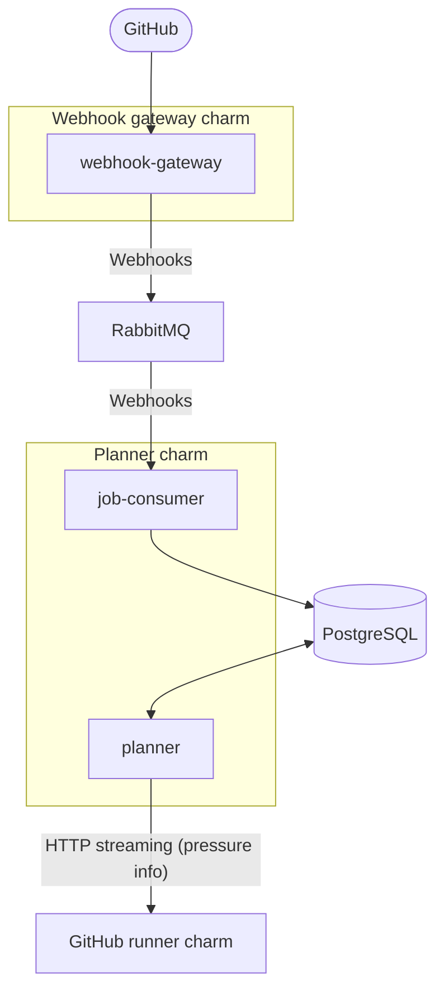

# Architecture overview

This product deploys two Juju charms that coordinate self-hosted GitHub Actions runners.
The architecture focuses on reliable webhook ingestion, durable event delivery, and a planner API
that manages runner flavors and job state.

## High-level overview of the deployment

## Components

- GitHub runner webhook gateway charm: includes a `webhook-gateway` component that receives,
  validates, and forwards GitHub webhooks to the AMQP broker.
- GitHub runner planner charm: includes a `job-consumer` component that processes workflow job
  events and writes job state to PostgreSQL, plus a `planner` API component that manages flavors
  and auth tokens.
- AMQP message broker: carries events from the webhook gateway to the planner. RabbitMQ is the
  expected broker.
- PostgreSQL database: stores job records, flavor definitions, and auth token metadata for the
  planner.
- [GitHub runner charm](https://github.com/canonical/github-runner-operator): consumes the planner relation to reconcile runner flavors and use auth
  tokens when interacting with the planner API.

## Event flow

GitHub sends workflow job webhooks to the webhook gateway, which validates the signature and
forwards the payload to the AMQP broker. The planner consumes the message, parses the workflow
job event, and stores job state changes in PostgreSQL. The planner API exposes job and flavor
endpoints, calculates flavor pressure internally, and streams pressure information to the GitHub
runner charm.

## Control plane and relations

- The webhook gateway requires a `rabbitmq` relation for AMQP connectivity.
- The planner requires `rabbitmq` and `postgresql` relations for event processing and storage.
- The planner provides a `planner` relation endpoint (using the `github_runner_planner_v0`
  interface) so the GitHub runner charm can retrieve auth tokens and desired flavor configuration.

## Observability

- Both charms emit OpenTelemetry traces when connected to a tracing charm.
- Both charms expose Prometheus metrics that can be scraped by a monitoring stack and visualized
  in Grafana dashboards.
- Logs and metrics should be used together to diagnose webhook ingestion failures, message broker
  delays, and job processing errors.
