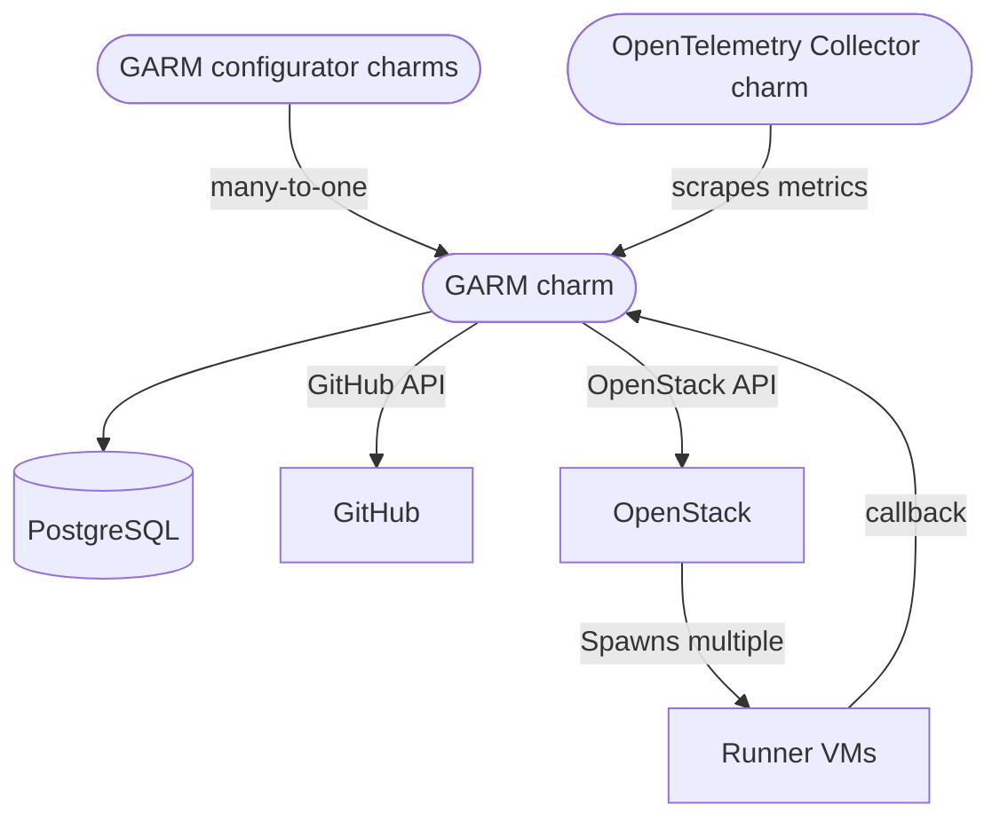

# Architecture overview

The GitHub runner deployment will utilize charms to manage the GitHub self-hosted runners. The GARM charm uses the [GitHub Actions Runner Manager (GARM)](https://github.com/cloudbase/garm) to manage the runners with the GARM configurator charm providing the configuration for the runners. In addition, the PostgreSQL charm is used to store the state of the GARM.

## High-level overview of the deployment

```mermaid
flowchart TD
  G(["GARM charm"]) --> PG[("PostgreSQL")]
  GC(["GARM configurator charms"]) -->|many-to-one| G
  G -->|GitHub API| GH["GitHub"]
  G -->|OpenStack API| OS["OpenStack"]
  OS -->|Spawns multiple| RUN["Runner VMs"]
  RUN -->|callback| G
  COS(["OpenTelemetry Collector charm"]) -->|scrapes metrics| G
```

There can be multiple GARM configurator charms providing configuration to a single GARM charm. Each GARM configurator charm manages the configuration for a single GitHub scaleset. 

## Components

- GARM charm: Operates a [GitHub Actions Runner Manager (GARM)](https://github.com/cloudbase/garm) instance which manages GitHub Scalesets. The Scaleset is a GitHub feature for managing a set of Self-hosted runners.
- GARM configurator charm: Provides configuration of a single GitHub scaleset to the GARM charm. Multiple GARM configurator charms can be related to a single GARM charm.
- PostgreSQL charm: Provides a PostgreSQL database for the GARM charm to store its state.
- OpenStack: The substrate where the runner VMs are spawned.

## Ingress

- The GARM charm services it REST API of GARM on the 8080 port. The spawned runners will need to call back to GARM on this port as part of the runner spawning process.

## Observability

- The GARM charm exposes Prometheus metrics that can be scraped by a monitoring stack and visualized
  in Grafana dashboards.
- The logs of the GARM charm are ingested by Loki to the dashboard.
